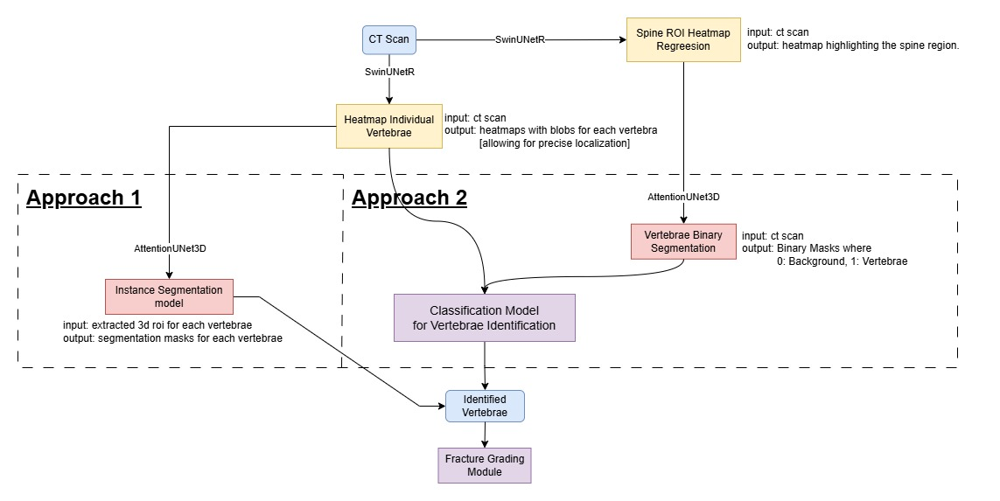

# Vertebrae Segmentation Pipeline

This project implements two approaches for spine and vertebrae segmentation using 3D CT scans. Below is a simple description of each approach and a checklist of tasks for each model.

1. **Input**: CT scan.
2. **Spine ROI Heatmap**: Generate a heatmap to locate the spine region.
3. **Vertebrae Heatmap**: Generate heatmaps for individual vertebrae.

##### **Approach 1: Binary Segmentation Pipeline**
4. **Binary Segmentation**: Segment the spine ROI into vertebrae (1) and background (0).
4. **Vertebrae Classification**: Classify each vertebra (e.g., C1, C2, T1, etc.).
5. **Output**:
   - **Labeled Vertebrae**: Each vertebra is identified and classified (e.g., C1, C2, T1, etc.).
   - **Segmentation Masks**: Binary masks for the entire spine and individual vertebrae.
##### **Approach 2: Instance Segmentation Pipeline**
4. **Instance Segmentation**: Segment each vertebra into a separate mask.
5. **Vertebrae Classification**: Classify each vertebra (e.g., C1, C2, T1, etc.).
6. **Output**: Labeled vertebrae with segmentation masks.

---

## **Branches**
This project has three branches:
1. **binary**: For binary segmentation and spine heatmap.
2. **multi**: For instance segmentation and vertebrae heatmap.
3. **fracture**: For fracture detection models.

## **Checklist of Models**

### **Shared Models**
- [ ] **Heatmap Regression**: Train SwinUNetR to generate spine ROI and vertebrae heatmaps.
- [ ] **Vertebrae Heatmap**: Train SwinUNetR to generate heatmaps for individual vertebrae.
- [ ] **Fracture Grading Module**: Train a fracture grading model to evaluate vertebral abnormalities.
##### **Approach 1: Binary Segmentation**
- [ ] **Binary Segmentation**: Train AttentionUNet3D for binary segmentation of the spine ROI.
- [ ] **Classification Model**: Train a classification model to label each vertebra (e.g., C1, C2, T1, etc.).

##### **Approach 2: Instance Segmentation**
- [ ] **Instance Segmentation**: Train AttentionUNet3D for instance segmentation of individual vertebrae.